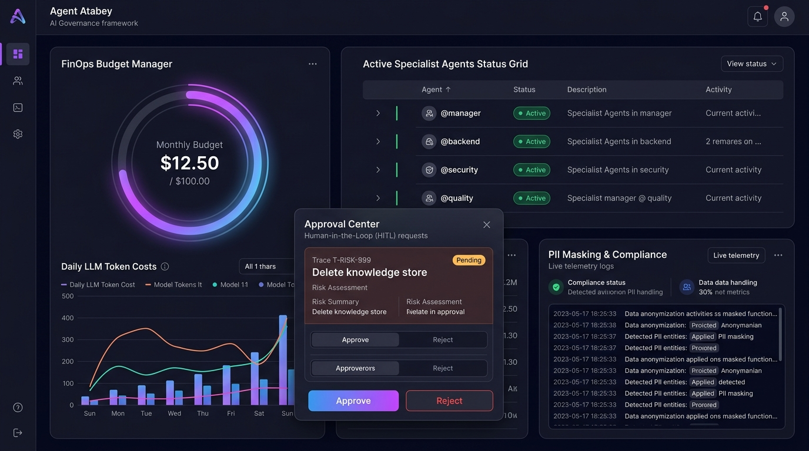
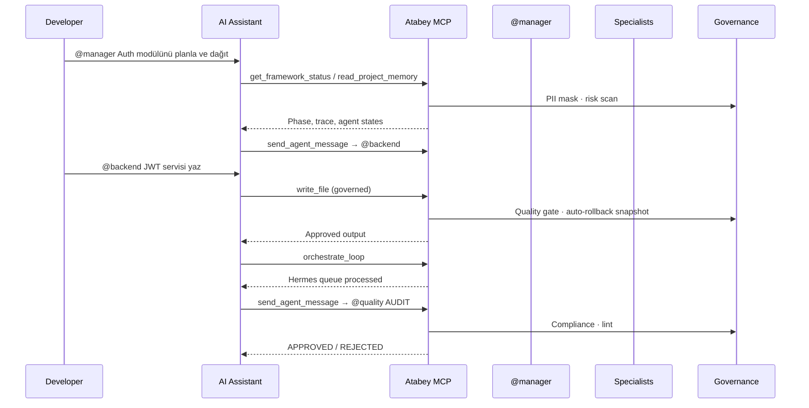

# [GOV] Agent Atabey — AI Governance & Multi-Agent Platform / Orchestrator

*Yapay Zeka Yönetişimi ve Çoklu Ajan Platformu / Orkestratörü*

[](https://github.com/ysf-bkr/atabey)
[](https://www.npmjs.com/package/atabey)
[](https://www.npmjs.com/package/atabey-mcp)
[](https://modelcontextprotocol.io)
[](https://github.com/ysf-bkr/atabey)
[](https://www.gnu.org/licenses/agpl-3.0)
[](https://github.com/ysf-bkr/atabey)
[](https://github.com/ysf-bkr/atabey)
[](https://github.com/ysf-bkr/atabey)
[](https://github.com/ysf-bkr/atabey)
[](https://github.com/ysf-bkr/atabey)
[](https://github.com/ysf-bkr/atabey)



**Agent Atabey** is an **AI Governance & Multi-Agent Platform / Orchestrator** built on MCP (Model Context Protocol). It sits on top of your existing AI coding interfaces — Claude Code, Gemini CLI, Cursor, Codex, Grok, Antigravity, or local LLMs — and turns them into a governed, multi-agent software engineering system.

| Layer | Role |
|-------|------|
| **Your AI IDE/CLI** | Writes code, runs tools, executes shell commands |
| **Atabey MCP Server** | 39 tools · multi-layer governance (10+ checks) · orchestration · memory |
| **@manager + 13 specialists** | Delegation, quality gates, risk control, audit trail |
| **`.atabey/` brain hub** | Constitution, memory, knowledge, registry, observability |

> [!NOTE]
> **Project Status (Pre-1.0):** Atabey is actively evolving toward a stable 1.0 release. The platform architecture is production-oriented; APIs may still change before 1.0.

> **Philosophy:** "Order from Chaos"
>
> **What Atabey is:** A deterministic governance and multi-agent orchestration middleware for AI coding assistants.
>
> **What Atabey is not:** A standalone LLM runtime (unlike LangGraph/CrewAI). Your connected AI assistant still generates code; Atabey disciplines, routes, validates, and coordinates it.

---

## 🚀 How It Works

Atabey connects to your AI interface as an **MCP tool server**. Once connected, you use `@agent` commands directly in your AI chat:

```
You (@backend): "Create a user login service with JWT authentication"
     │
     ▼
  Atabey MCP Server (atabey-mcp/)
     │  Intercepts @agent command
     │  Routes via RoutingEngine (TF-IDF + Semantic)
     │  Routes to @backend specialist
     │  Multi-Layer Governance Pipeline validates
     │  Quality Gate checks output
     │  Stores in Vector Memory
     │
     ▼
  Returns governed, reviewed, audited code
```

**No separate terminal needed. No CLI commands for daily use.** Just chat with your AI and use `@agent` syntax.

## 🧠 How Atabey Relates to Your AI

> [!IMPORTANT]
> **Atabey does not write code.** The code is written by the AI assistant you are connected to (such as Claude Code, Gemini CLI, or Cursor). 
> Atabey wraps your AI assistant with a powerful, deterministic software engineering discipline and governance layer:
> 
> 1. **Routing:** Directs instructions to the correct specialized virtual agent profile (`@backend`, `@security`, etc.).
> 2. **Risk Engine:** Automatically scores operations for safety and halts risky actions (like mass deletions) for human approval.
> 3. **Quality Gate:** Reviews the generated output against corporate standards, syntax correctness, and test metrics.
> 4. **Memory:** Keeps track of past architectural decisions and specialty conventions so your AI assistant learns from history.
> 
> *We do not mimic the LLM; we discipline it.*

---

## 📋 Table of Contents

- [Platform Architecture](#platform-architecture)
- [Orchestration Flow](#orchestration-flow)
- [Quick Start](#quick-start)
- [MCP Connection (IDE/CLI)](#mcp-connection-idecli)
- [5 Core Capabilities Overview](#5-core-capabilities-overview)
- [How Atabey Plugs Into Your AI](#how-atabey-plugs-into-your-ai)
- [Supported Platforms](#supported-platforms)
- [Installation](#installation)
- [Profile-Based Setup](#profile-based-setup)
- [13 Specialized Agents](#13-specialized-agents)
- [39 MCP Tools](#39-mcp-tools)
- [7 Core Skills](#7-core-skills)
- [3-Layer Memory System](#3-layer-memory-system)
- [Knowledge Base (30+ Standards)](#knowledge-base-30-standards)
- [Multi-Layer Governance Pipeline](#multi-layer-governance-pipeline)
- [Core Features](#core-features)
- [Dashboard](#dashboard)
- [CLI Reference](#cli-reference)
- [Architecture](#architecture)
- [Security](#security)
- [KVKK/GDPR Compliance](#kvkkgdpr-compliance)
- [EU AI Act Alignment](#eu-ai-act-alignment)
- [Token Economy & FinOps](#token-economy--finops)
- [Contributing](#contributing)

---

## Platform Architecture

```
┌─────────────────────────────────────────────────────────────────────────┐
│                         USER / DEVELOPER                                 │
│              @manager planla · @backend API yaz · @quality audit       │
└───────────────────────────────┬─────────────────────────────────────────┘
                                │
        ┌───────────────────────┼───────────────────────┐
        ▼                       ▼                       ▼
┌───────────────┐      ┌───────────────┐      ┌───────────────┐
│ Claude Code   │      │ Gemini CLI    │      │ Cursor IDE    │
│ .claude/      │      │ .gemini/      │      │ .cursor/      │
└───────┬───────┘      └───────┬───────┘      └───────┬───────┘
        │                      │                      │
        └──────────────────────┼──────────────────────┘
                               │ MCP (stdio) — IDE default
                               ▼
┌─────────────────────────────────────────────────────────────────────────┐
│                    ATABEY MCP SERVER (atabey-mcp)                        │
│  Governance Pipeline · Hermes Queue · Orchestrator · Vector Memory       │
│  Risk Engine · FinOps · Auto-Rollback · Human-in-the-Loop               │
└───────────────────────────────┬─────────────────────────────────────────┘
                                │
                                ▼
┌─────────────────────────────────────────────────────────────────────────┐
│  .atabey/  Brain & Memory (SSOT)     │  .agents/  Unified Agent Hub    │
│  ATABEY.md · memory/ · knowledge/     │  7 platform mirrors + skills    │
└─────────────────────────────────────────────────────────────────────────┘
```

**Monorepo layout:**

| Package | Purpose |
|---------|---------|
| `packages/atabey` | CLI, adapters, agent export, init |
| `packages/atabey-mcp` | MCP server, governance middleware, dashboard API |
| `packages/shared` | Shared constants, PII, audit, storage (SSOT) |

---

## Orchestration Flow



**Orchestrator auto-start (default):** When your IDE connects to the MCP server (`mcp.json`), Atabey automatically boots the headless **AgentLoop** orchestrator in the background. No separate terminal is required for daily multi-agent work.

```bash
# Optional — interactive TUI dashboard loop
npx atabey orchestrate

# Optional — unified HTTP server + dashboard UI
MCP_TRANSPORT=unified MCP_PORT=5858 npx atabey-mcp
```

Disable auto-start: set `"orchestrator": { "autoStart": false }` in `.atabey/config.json` or `ATABEY_AUTO_START_ORCHESTRATOR=false` in `mcp.json`.

### Project kinds

| Kind | Where | App paths (`apps/backend`, `apps/web`) |
|------|-------|----------------------------------------|
| **consumer** | Your application repo after `atabey init` | ✅ Scaffolded by init |
| **framework-monorepo** | This GitHub repository (`packages/*`) | ❌ Not applicable — use `packages/atabey`, `packages/atabey-mcp/dashboard` |

---

## Quick Start

### 1. Initialize Atabey in Your Project

> **Consumer projects:** `atabey init` scaffolds `apps/backend`, `apps/web`, `docs/`, etc.  
> The **Atabey framework monorepo** itself does not contain `apps/*` — those paths appear only after you install Atabey in your own application repository.

```bash
# Single platform (your app repo)
npx atabey init gemini --profile freelancer --yes

# All 7 platforms (recommended for teams)
npx atabey init gemini --unified --profile team --yes

# Framework monorepo maintainers only (this repository)
npm install          # postinstall runs atabey:setup if .atabey/ is missing
npm run atabey:setup # or run manually
```

### 2. Verify MCP & Platform Health

```bash
npx atabey check     # MCP transport, unified layout, AL registry, compliance
npx atabey status    # Phase, trace, agent states
```

### 3. Connect to Your AI Interface (MCP auto-starts)

`atabey init` generates `mcp.json` with **`MCP_TRANSPORT=stdio`** and **`ATABEY_AUTO_START_ORCHESTRATOR=true`**. Your IDE spawns the MCP server automatically — orchestrator included. Point your AI assistant to it:

**Claude Code:**
```json
{
  "mcpServers": {
    "atabey": {
      "command": "npx",
      "args": ["-y", "atabey-mcp"],
      "env": {
        "MCP_TRANSPORT": "stdio",
        "ATABEY_PROJECT_ROOT": "/path/to/your/project",
        "ATABEY_AUTO_START_ORCHESTRATOR": "true"
      }
    }
  }
}
```

**Gemini CLI:**
```bash
gemini config set mcpServers.atabey.command "npx"
gemini config set mcpServers.atabey.args "[\"-y\", \"atabey-mcp\"]"
gemini config set mcpServers.atabey.env "{\"MCP_TRANSPORT\": \"stdio\", \"ATABEY_PROJECT_ROOT\": \"/path/to/your/project\"}"
```

**Cursor** (`.cursor/mcp.json` — auto-generated by init):

```json
{
  "mcpServers": {
    "atabey": {
      "command": "node",
      "args": ["node_modules/atabey-mcp/dist/atabey-mcp/src/mcp/index.js"],
      "env": {
        "MCP_TRANSPORT": "stdio",
        "ATABEY_PROJECT_ROOT": "/path/to/your/project",
        "ATABEY_AUTO_START_ORCHESTRATOR": "true"
      }
    }
  }
}
```

> [!IMPORTANT]
> **MCP transport modes**
> - **`stdio`** (default) — Claude, Cursor, Gemini, Codex, Grok. Set by `atabey init` and `atabey mcp install`.
> - **`unified`** — HTTP/SSE server on port 5858 for dashboard and remote clients: `MCP_TRANSPORT=unified MCP_PORT=5858 atabey-mcp`
>
> Repair a broken config: `atabey mcp install`

---

## MCP Connection (IDE/CLI)

| Step | Command | Result |
|------|---------|--------|
| Init | `atabey init gemini --unified --yes` | Agents + 7 adapter MCP configs + shims |
| Repair | `atabey mcp install` | Refreshes root `mcp.json` (stdio + auto-orchestrator) |
| IDE connect | Open Claude / Cursor / Gemini | MCP + orchestrator start automatically |
| Debug | `atabey mcp start` | Manual stdio MCP for troubleshooting |
| Health | `atabey check` | Validates `MCP_TRANSPORT`, unified layout, AL registry |

**Platform orchestration strength:**

| Platform | Orchestration | Best role |
|----------|---------------|-----------|
| Claude Code | Full (7 skills) | Primary orchestrator |
| Gemini CLI | Strong (6 skills) | Commander / strategist |
| Local LLM | Strong | Offline / private |
| Antigravity CLI | Strong | Custom agent JSON |
| Cursor / Grok / Codex | Limited (4 skills) | Implementer / editor |

### 4. Start Using in AI Chat

Open your AI interface and simply type:

```
@backend Create a REST API for user management with CRUD operations
@security Audit the authentication middleware
@quality Run compliance check on the new feature
```

**That's it.** Atabey handles routing, quality gates, memory, governance, and audit automatically.

---

## 5 Core Capabilities Overview

Atabey AL is built on **5 core capabilities** that work together seamlessly:

| # | Capability | Description | Score |
|---|-----------|-------------|-------|
| 🛠️ | **39 MCP Tools** | File system, search, messaging, governance, memory, quality, network, orchestration | 82/100 |
| 🧠 | **3-Layer Memory** | Vector Memory (TF-IDF/OpenAI), Project Memory, Specialty Memory (agent learning) | 78/100 |
| 🤖 | **13 Specialized Agents** | 3-tier hierarchy (Supreme/Core/Recon) with state machine | 80/100 |
| 🎯 | **7 Core Skills** | Platform-adaptive skills for 7 different AI platforms | 72/100 |
| 📚 | **30+ Knowledge Standards** | Governance, security, architecture, compliance, deployment standards | 85/100 |
| **🎯** | **Overall** | **AI Governance & Multi-Agent Platform / Orchestrator** | **74/100** |

> Scores reflect pre-1.0 maturity: strong governance and MCP tooling; orchestration depth varies by platform adapter.

---

## How Atabey Plugs Into Your AI

```
┌──────────────────────────────────────────────────────────────────┐
│                   YOUR AI INTERFACE                                │
│   Claude Code · Gemini CLI · Cursor · Codex CLI · Local LLM      │
│   You type: @backend Create login service                         │
├──────────────────────────────────────────────────────────────────┤
│                    MCP PROTOCOL (stdio/SSE)                        │
│   JSON-RPC messages over stdin/stdout or HTTP/SSE                 │
├──────────────────────────────────────────────────────────────────┤
│                    ATABEY MCP SERVER                               │
│   ┌──────────────────────────────────────────────────────────┐   │
│   │  39 Tools · Multi-Layer Governance Pipeline ·               │   │
│  │  Risk Engine · Loop Detection · FinOps · Auto-Rollback  │   │
│   └──────────────────────────────────────────────────────────┘   │
├──────────────────────────────────────────────────────────────────┤
│                    GOVERNANCE LAYER                                │
│   Quality Gate → Risk Engine → Vector Memory → Audit Log         │
│   PII Masking → Discipline → License Scan → Injection Protection │
└──────────────────────────────────────────────────────────────────┘
```

Atabey is **not a separate execution engine**. It is a context-aware governance and policy middleware that intercepts, validates, and routes the actions of AI coding assistants:
- **13 Specialized Agent Contexts** (injected templates to structure AI reasoning)
- **Deterministic Quality Gates** (AST analysis + lint + governance validation)
- **Risk Gate & Heuristic Scanning** (blocking dangerous commands, requiring human approval)
- **Persistent Vector Memory** (TF-IDF + OpenAI embeddings, cosine similarity search)
- **Audit trails** (every action logged, supporting KVKK/GDPR technical alignment)

---

## Supported Platforms

Atabey AL supports **7 platforms** with automatic adapter configuration:

| Platform | MCP Mode | Agents Export | Tools | Skills | Shim |
|----------|----------|---------------|-------|--------|------|
| **Claude Code** ⭐ | `.mcp.json` + `claude_desktop_config.json` | `.claude/agents/*.md` | 20 tools | 7 skills | `CLAUDE.md` |
| **Gemini CLI** | `.gemini/mcp.json` | `.gemini/agents/*.md` | 14 tools | 6 skills | `GEMINI.md` |
| **Cursor IDE** | `.cursor/mcp.json` | `.cursor/rules/*.mdc` | 9 tools | 4 skills | `CURSOR.mdc` |
| **Codex CLI (Copilot)** | `.vscode/mcp.json` + `.mcp.json` | `.agents/instructions/*.md` | 9 tools | 4 skills | `copilot-instructions.md` |
| **Antigravity CLI** | `.agents/mcp_config.json` | `.agents/agents/*.md` + `agent.json` | 14 tools | 6 skills | `AGENTS.md` |
| **Grok** | `.grok/mcp_config.json` | `.grok/agents/*.md` | 9 tools | 4 skills | `GROK.md` |
| **Local LLM (Ollama)** | `.atabey/mcp_config.json` | `.atabey/agents/*.md` | 14 tools | 6 skills | `LOCAL_AI.md` |

> **Unified Mode:** `atabey init claude --unified` exports agents to **ALL platforms simultaneously**.

---

## Installation

### Requirements

| Requirement | Version |
|------------|---------|
| **Node.js** | >= 18.0.0 |
| **npm** | >= 9.0.0 |
| **AI Interface** | Claude Code, Gemini CLI, Cursor, Codex CLI, Grok, Antigravity, Local LLM |

### Quick Install

```bash
# Install globally (recommended)
npm install -g atabey

# Initialize with your preferred platform and profile
npx atabey init gemini --profile freelancer --yes

# Verify installation
npx atabey status

# (Optional) Open the web dashboard
npx atabey dashboard
```

### Native Dependency & CI/CD Considerations

Atabey utilizes `better-sqlite3` for local state persistence and high-performance vector operations. Since `better-sqlite3` includes native C++ modules, it requires binary compilation during installation under certain environments.

If you encounter installation or test run issues (especially in restricted sandbox or CI/CD environments with no internet access or build tools):

1. **Prebuilt Binaries:** npm will automatically try to download prebuilt binaries for your platform. Ensure your environment has outgoing network access to the GitHub/npmjs package registries.
2. **Build Tools:** Ensure you have `python`, `make`, and a C++ compiler (like `gcc`/`g++`) installed on your system if you need to build from source.
3. **CI/CD Environments:** For CI/CD test runners, you can bypass native sqlite3 compile-time issues by running with the `--ignore-scripts` flag if you only need the static analysis and typescript compilation checks:
   ```bash
   npm install --ignore-scripts
   ```

---

## Profile-Based Setup

Choose the profile that matches your team size. You can also customize your setup using **`--focus`** and **`--lang`** options.

### `--profile freelancer` (1-3 people)

```bash
npx atabey init gemini --profile freelancer
```

| Feature | What You Get |
|---------|-------------|
| **Agents** | `@manager`, `@quality` + focus-specific agents |
| **Setup Time** | ~10 seconds |
| **Daily Workflow** | Chat with AI using specialist agents |
| **Governance** | Quality gate + risk engine |
| **Best For** | Solo developers, minimal overhead |

### `--profile team` (5-15 people)

```bash
npx atabey init gemini --profile team --unified
```

| Feature | What You Get |
|---------|-------------|
| **Agents** | 5-8 focus-specific agents (manager, architect, backend, quality, database, security) |
| **Setup Time** | ~30 seconds |
| **Dashboard** | 12 live modules, WebSocket real-time |
| **Governance** | Quality gate + risk engine + contract validation |
| **Best For** | Small-medium teams with governance needs |

### `--profile enterprise` (15+ people)

```bash
npx atabey init gemini --profile enterprise
```

| Feature | What You Get |
|---------|-------------|
| **Agents** | All 13 agents (Supreme + Core + Recon) |
| **Setup Time** | ~1 minute |
| **Security** | Human-in-the-Loop, KVKK PII masking, audit log |
| **Governance** | Full governance with circuit breakers |
| **Best For** | Enterprise with compliance requirements |

---

## 13 Specialized Agents

> [!NOTE]
> **Execution Model:** Atabey's specialized agents are virtual profiles powered by dynamically injected system role definitions and context templates. They do not run as 13 parallel, independent LLM API instances. Instead, your single host AI assistant (e.g., Claude Code, Gemini CLI) takes on these roles sequentially, routed by the TF-IDF engine, while Atabey enforces boundaries, state machine constraints, and quality checks during role switches.

| Agent | Tier | Capability | Role | Freelancer | Team | Enterprise |
|-------|------|:----------:|------|:----------:|:----:|:----------:|
| **@manager** | Supreme | 10/10 | Orchestration, governance, quality gate | ✅ | ✅ | ✅ |
| **@security** | Supreme | 10/10 | Security audit, vulnerability scanning | ❌ | ✅ | ✅ |
| **@architect** | Core | 9/10 | System design, contracts, architecture | ❌ | ✅ | ✅ |
| **@backend** | Core | 9/10 | Backend dev, API, business logic, tests | ✅ | ✅ | ✅ |
| **@frontend** | Core | 9/10 | UI, atomic components, responsive design | ❌ | ✅ | ✅ |
| **@quality** | Core | 9/10 | Compliance, lint, test coverage | ✅ | ✅ | ✅ |
| **@database** | Core | 9/10 | Database management, migrations, queries | ❌ | ✅ | ✅ |
| **@analyst** | Recon | 8/10 | Strategy analysis, requirements | ❌ | ❌ | ✅ |
| **@mobile** | Core | 8/10 | React Native mobile development | ❌ | ❌ | ✅ |
| **@native** | Recon | 8/10 | Native platform integration | ❌ | ❌ | ✅ |
| **@devops** | Core | 8/10 | CI/CD, deploy, infrastructure | ❌ | ❌ | ✅ |
| **@explorer** | Recon | 8/10 | Codebase discovery, analysis | ❌ | ❌ | ✅ |
| **@git** | Recon | 8/10 | Version control, commit management | ❌ | ❌ | ✅ |
| **@human** | — | — | Human approval placeholder | ✅ | ✅ | ✅ |

### Agent Hierarchy
```
User / External Request
    ↓
  @manager (Supreme Authority)
    ↓
  @security (Parallel — always watching)
    ↓
  @architect → @backend / @frontend / @database / @devops
    ↓
  @quality → @mobile / @native / @explorer / @git / @analyst
```

---

## 39 MCP Tools

### File System (6)
`read_file`, `view_file`, `write_file`, `replace_text`, `batch_surgical_edit`, `patch_file`

### Search & Exploration (4)
`list_dir`, `grep_search`, `get_project_map`, `get_project_gaps`

### Framework & System (10)
`run_shell_command`, `run_tests`, `get_system_health`, `check_active_ports`,
`get_framework_status`, `read_project_memory`, `get_memory_insights`,
`update_project_memory`, `orchestrate_loop`, `submit_plan`

### Control Plane (3)
`acquire_lock`, `release_lock`, `register_agent`

### Memory & Knowledge (4)
`store_knowledge`, `search_knowledge`, `delete_knowledge`, `update_contract_hash`

### Messaging & Human (3)
`send_agent_message`, `log_agent_action`, `ask_human`

### Compliance & Quality (4)
`mask_pii`, `analyze_code_quality`, `check_architecture_compliance`, `check_lint`

### Operations (3)
`approve_operation`, `compress_files`, `decompress_files`, `http_proxy_request`, `audit_dependencies`

---

## 7 Core Skills

| Skill | Tools | Description |
|-------|-------|-------------|
| **FILE_SYSTEM** | read_file, write_file | Token-efficient file operations |
| **EDITING** | replace_text, patch_file | Surgical code modification |
| **ORCHESTRATION** | orchestrate_loop, send_agent_message, get_framework_status, log_agent_action | Hermes messaging |
| **GOVERNANCE** | acquire_lock, release_lock, register_agent, update_contract_hash | Resource locking & contracts |
| **QUALITY_ASSURANCE** | run_shell_command, view_file | Testing & code quality |
| **DATABASE_MANAGEMENT** | view_file, replace_text, run_shell_command | DB & migrations |
| **DEVOPS_INFRASTRUCTURE** | run_shell_command, view_file | CI/CD & deployment |

Each skill adapts to the target platform (Claude → native tool names, Gemini → YAML, Codex → categories).

---

## 3-Layer Memory System

| Layer | Storage | Technology | Purpose |
|-------|---------|------------|---------|
| **Vector Memory** | SQLite | TF-IDF / OpenAI embeddings + Cosine similarity | Semantic search across project knowledge |
| **Project Memory** | Markdown | `PROJECT_MEMORY.md` | Central project state, synchronized every session |
| **Specialty Memory** | Markdown | `.atabey/memory/specialties/{agent}.md` | Per-agent learned conventions from past tasks |

**Memory Flow:**
```
Task → Evaluation Engine → Score (0-100)
  ├── Success → extractSuccessLesson() → updateSpecialtyMemory()
  └── Failure → compliance/lint/test lesson → updateSpecialtyMemory()
       ↓
  Next session: readLearnedConventions() → injected into agent prompt
```

---

## Knowledge Base (30+ Standards)

| Category | Standards |
|----------|-----------|
| **Governance** | governance-standards, llm-governance, crud-governance |
| **Architecture** | architecture-standards, auth-standards |
| **Development** | frontend-standards, nextjs-standards, mobile-standards, kysely-standards |
| **Security** | security-standards, security-audit-standards, logging-and-secrets |
| **DevOps** | deployment-standards, github-actions-standards |
| **Quality** | quality-standards, testing-standards, vitest-standards, playwright-standards |
| **Performance** | performance-standards, observability-standards |
| **UI/UX** | tailwind-standards, react-query-standards, react-router-standards |
| **Data** | typeorm-standards, vite-standards |
| **Economics** | token-economy, pino-standards, swagger-standards |

Agent knowledge files are automatically embedded into system prompts at build time.

---

## Multi-Layer Governance Pipeline

Every MCP tool call passes through this pipeline:

```
CallToolRequest
    ↓
 1. [VALIDATION]      Zod schema validation
 2. [GOVERNANCE]      validateArgsAgainstRules()
 3. [DISCIPLINE]      enforceDiscipline()
 4. [LOOP DETECTION]  recordAndCheck() + cooldown
 5. [FINOPS]          budgetManager.recordUsage()
 6. [LICENSE]         validateLicenseCompliance()
 7. [AUTO-ROLLBACK]   prepareWrite() snapshot
 8. [HUMAN-IN-LOOP]   RiskEngine.assessTaskRisk() + checkRiskGate()
 9. [PII MASKING]     maskToolArgs() → mask before handler
 10. [EXECUTION]      Tool handler runs
 11. [POST-VALIDATION] scanFileForViolations() → rollback if needed
 12. [INJECTION PROTECTION] sanitizeResponse()
 13. [PII MASKING]    maskToolResult() → mask before returning to AI
    ↓
  Return governed result
```

---

## Core Features

### Deterministic Quality Gate
No agent can push code directly to production. All outputs pass through AST analysis (compliance) + linting + governance validation.

### Smart Routing Engine
TF-IDF + Semantic (cosine similarity) routing with 60/40 blend. Falls back to keyword-based routing when embeddings are unavailable.

### Hermes Message Broker
SQLite-backed async message queue for inter-agent communication. Lock-based protocol prevents race conditions.

### Risk Engine (Human-in-the-Loop)
Operations containing `DROP`, `DELETE`, `TRUNCATE`, or secret manipulation are flagged. Score ≥ 60 requires human approval.

### Specialty Memory (Agent Learning)
Agents learn from both successes and failures. Lessons stored in `.atabey/memory/specialties/` and auto-injected next session.

### Auto-Rollback
Pre-write snapshots, post-write governance scan, automatic rollback + regenerate instructions for the AI.

### Token Economy & Cost Tracking
Per-agent token/cost tracking via MCP governance middleware. Budget enforcement is **config-driven** in `.atabey/config.json` (`finops` section) and auto-starts with the MCP server. See [Token Economy & FinOps](#token-economy--finops).

### Prompt Injection Protection
OWASP LLM01 compliant sanitization detected via role-playing, system prompt override, delimiters, and context manipulation patterns.

### Multi-Client MCP (Stdio + HTTP/SSE)
Two transport modes: Stdio (per-developer) and HTTP/SSE (shared server for entire team, port 5858).

---

## Dashboard

```bash
npx atabey dashboard  # Opens at http://localhost:5858
```

| Module | Description | Update |
|--------|-------------|--------|
| 🤖 **Agent Monitor** | AI agent status + tasks | WS (5s) |
| 📨 **Hermes Stats** | Message queue statistics | WS (5s) |
| 💬 **Hermes Messages** | Message queue viewer + filter | WS (5s) |
| 🔐 **Approval Center** | Human-in-the-Loop approvals | WS |
| 📋 **Task Planner** | Task DAG + progress | REST (5s) |
| 📝 **Agent Logs** | Execution logs | WS (5s) |
| ⚠️ **Error Tracker** | Lint/compliance/security errors | WS |
| 🧠 **Memory Insights** | Vector memory search | REST |
| 🛡️ **Compliance** | Quality gate violations | REST (15s) |
| ✅ **Quality Panel** | Code quality analysis | REST |
| 🔌 **Adapters** | Adapter-skill mapping | REST |
| 🔒 **GDPR / KVKK** | PII masking, erasure, audit trail | REST |

---

## CLI Reference

```bash
atabey init [adapter]        Initialize Atabey (--profile freelancer|team|enterprise)
atabey mcp start             Start MCP server (connects to your AI interface)
atabey mcp install           Generate mcp.json config for AI integration
atabey dashboard [port]      Open web dashboard (default: 5858)
atabey status                Show agent statuses and costs
atabey check                 Full health and compliance check
atabey orchestrate           Start orchestration workflow loop
atabey approve <traceId>     Approve a blocked high-risk task
atabey hitl answer "<text>"  Answer a pending ask_human question
atabey @agent "task"         Send task directly to an agent
atabey trace:new             Create a new trace
atabey verify-contract       Verify contract integrity
atabey plan [task]           Create a task plan
atabey memory                View project memory
atabey log [agent]           View agent logs
atabey explore [path]        Explore codebase
atabey security [path]       Run security audit
```

### `atabey init [adapter]` Options

| Option | Values | Description |
|--------|--------|-------------|
| `[adapter]` | `gemini`, `claude`, `cursor`, `grok`, `codex`, `local`, `antigravity-cli` | Target AI platform |
| `--profile` | `freelancer`, `team`, `enterprise` | Preset agent group layout |
| `--focus` | `fullstack`, `backend`, `frontend`, `mobile`, `mobile-fullstack` | Project type optimization |
| `--lang` | `tr`, `en` | Constitution language |
| `--unified` | Flag | Multi-platform export |
| `--yes` | Flag | Non-interactive mode |

---

## Architecture

```
┌──────────────────────────────────────────────────────────────────┐
│                      AI Chat Interface                            │
│    @backend Create login service (in Claude/Gemini/Cursor)      │
├──────────────────────────────────────────────────────────────────┤
│                    MCP Server (atabey-mcp/)                       │
│                    39 Tools · Multi-Layer Governance                │
│                    Zod Validation · PII Masking                  │
├──────────────────────────────────────────────────────────────────┤
│                    src/cli/  30+ Commands                         │
│                    src/modules/  Engines + Agents + Memory       │
│                    src/shared/  Types + Storage + Audit          │
├────────────────┬───────────────────────────┬──────────────────────┤
│                ▼                           ▼                      │
│  ┌──────────────────────────┐  ┌──────────────────────────────┐  │
│  │ Web Dashboard            │  │ SQLite (better-sqlite3)      │  │
│  │ Port 5858                │  │ Vector Memory · Hermes Queue │  │
│  │ 12 Module WS Live        │  │ Audit Logs · Locks · Tasks  │  │
│  │ Responsive (Mob+Desk)    │  │ Knowledge · Agent Registry  │  │
│  └──────────────────────────┘  └──────────────────────────────┘  │
└──────────────────────────────────────────────────────────────────┘
```

---

## Security

### Enterprise-Grade Governance
Deterministic rules: AST compliance parsing, strict TypeScript type validation (zero `any`), automated governance checks.

### Zero Type Hole Policy
- `any` type usage is **strictly forbidden**
- All function inputs validated with Zod schemas
- Type safety enforced in governance pipeline

### PII Masking (KVKK/GDPR Technical Alignment)
- All logs scanned for Personally Identifiable Information
- Sensitive data automatically masked (20+ patterns)
- Designed to assist with Turkish KVKK (Law No. 6698) and EU GDPR controls
- **Right to Erasure** (KVKK Art. 7 / GDPR Art. 17) technical support

### Human-in-the-Loop
- Risk score ≥ 60 requires human approval
- In-chat approval: `approve_operation` MCP tool
- Terminal fallback: `atabey approve <traceId>`

### AI Discipline Engine
- Rate Limiting: Max 60 calls/minute per agent
- File Size Limits: Prevents >1MB files
- Loop Detection: Blocks >10 consecutive same-tool calls
- Cooldown Mechanism: Automatic when limits exceeded
- Injection Protection: Aligned with OWASP LLM01 guidelines

---

## KVKK/GDPR Technical Alignment

> **Scope:** Technical compliance tooling — not legal certification. Pair with your DPO/legal counsel for production deployments.

| Feature | KVKK | GDPR | Status |
|---------|------|------|--------|
| PII Masking (20+ patterns) | Art. 4, 5, 11, 12 | Art. 5, 32 | ✅ Implemented |
| Data Retention (30/90 days) | Art. 5, 7 | Art. 5, 17 | ✅ Auto-cleanup on MCP boot |
| Right to Erasure | Art. 7 | Art. 17 | ✅ `/api/audit/erase` + trace erase |
| Audit Trail | Art. 11 | Art. 30 | ✅ SQLite audit log |
| Data Classification | Art. 6 | Art. 9 | ✅ Category-based retention |
| Consent Logging | Art. 5 | Art. 7 | ✅ `.atabey/compliance/consent-log.json` |

Configure in `.atabey/config.json`:

```json
{
  "compliance": {
    "retentionEnabled": true,
    "consentLogging": true,
    "piiMasking": true,
    "dataProcessingBasis": "consent"
  }
}
```

Dashboard API: `GET /api/compliance/consent`, `GET /api/compliance/retention`

---

## EU AI Act Alignment

Atabey provides **process and governance alignment** with the EU AI Act via `.atabey/knowledge/llm-governance.md` (scaffolded on `atabey init`):

| EU AI Act principle | Atabey implementation |
|---------------------|----------------------|
| Human oversight | Human-in-the-Loop, risk score ≥ 60 → approval |
| Risk classification | High-risk ops (auth, billing, moderation) gated by `@manager` |
| Transparency | AI-generated output labeling rules in llm-governance |
| Data protection | PII masking, retention, erasure (KVKK/GDPR layer) |
| Robustness & safety | Loop detection, injection protection (OWASP LLM01), auto-rollback |

> **Not included:** CE marking, conformity assessment, DPIA templates, or legal EU AI Act certification. Use Atabey as a **technical control layer** alongside legal review.

---

## Token Economy & FinOps

FinOps **auto-starts** when the MCP server boots. Defaults are profile-based:

| Profile | Tracking | Budget enforcement |
|---------|----------|-------------------|
| `freelancer` | ✅ Always | ❌ Off (track only) |
| `team` | ✅ Always | ❌ Off by default |
| `enterprise` | ✅ Always | ✅ $500/mo default |

Configure in `.atabey/config.json`:

```json
{
  "finops": {
    "tracking": true,
    "enforcement": true,
    "monthlyBudgetUsd": 200,
    "agentMaxBudgetUsd": 40,
    "team": "my-team",
    "alertThresholds": [50, 80, 90, 100],
    "costPer1kTokensUsd": 0.003
  }
}
```

Environment overrides (optional):

```bash
ATABEY_BUDGET_ENABLED=true
ATABEY_BUDGET_MONTHLY=200
ATABEY_BUDGET_AGENT_MAX=40
```

- **Tracking mode:** logs estimated tokens per MCP tool call, exposes `/api/finops`
- **Enforcement mode:** blocks tool calls when monthly/agent budget exceeded
- **Alerts:** stderr warnings at 50/80/90/100% thresholds

Check status: `atabey status` · Dashboard: `GET /api/finops`

---

## Testing

```bash
npm test                    # Run all tests
npm run test:watch          # Watch mode
npm run test:coverage       # Coverage report
```

---

## Contributing

Please read [CONTRIBUTING.md](CONTRIBUTING.md) for details on the code of conduct and pull request process.

```bash
git clone https://github.com/ysf-bkr/atabey.git
cd atabey
npm install
npm run build
```

---

## License & Business Model

**Code:** GNU Affero General Public License v3.0 — [Yusuf BEKAR](mailto:ybekar@msn.com)

This program is free software: you can redistribute it and/or modify it under the terms of the GNU Affero General Public License as published by the Free Software Foundation, either version 3 of the License, or (at your option) any later version.

**Network Use Clause (Section 13):** If you modify the Program and make it accessible over a network (e.g., as a SaaS service), you must provide the complete corresponding source code to all users who interact with it remotely.

**Service Model:**
- **Enterprise Support & SLA** — Guaranteed response times, priority bug fixes, custom integrations
- **Consulting & Training** — Team onboarding, governance policy design, architecture review
- **Managed Enterprise Server** — Centralized telemetry, multi-team budget management, org-wide dashboard

Enterprise inquiries: **ybekar@msn.com**

---

*Developer: **Yusuf BEKAR** — "Order from Chaos"*
